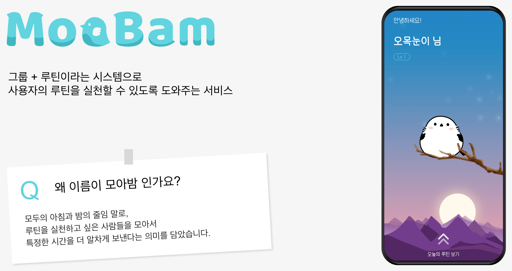
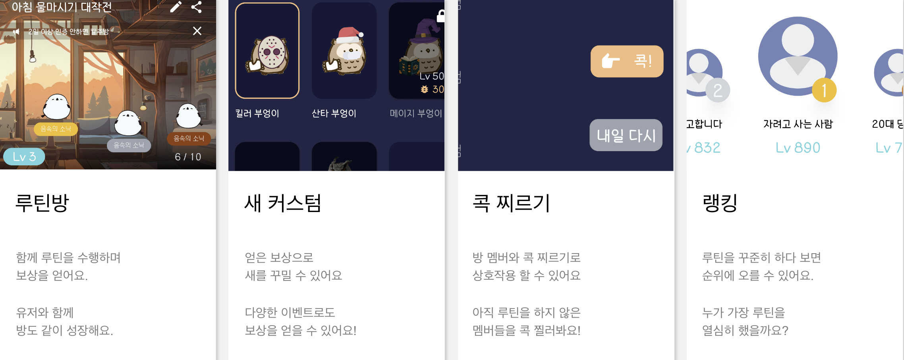
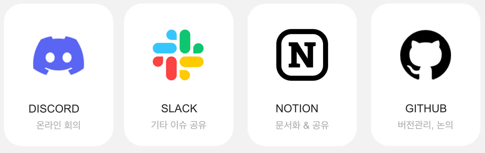
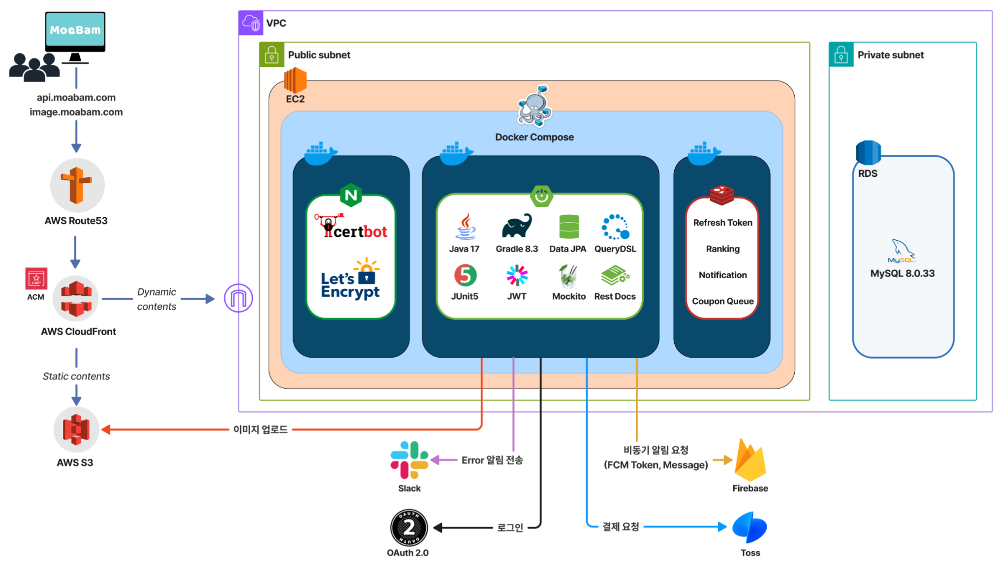
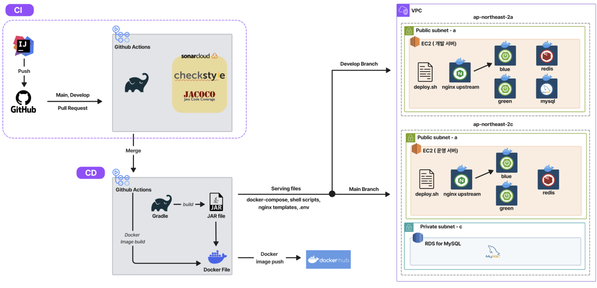
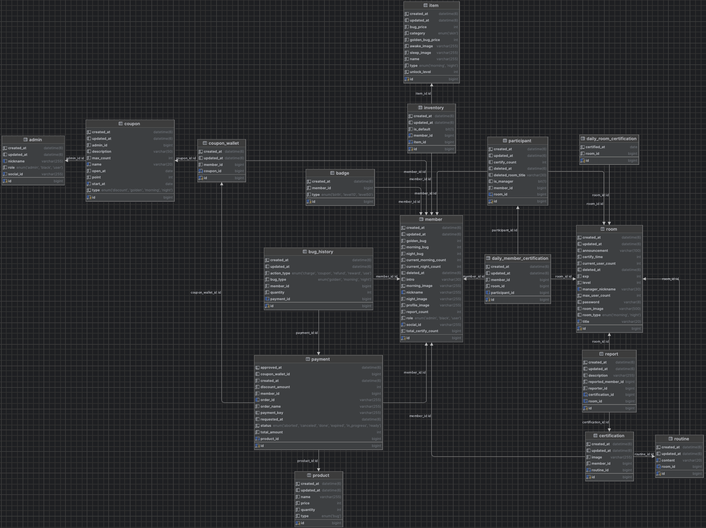
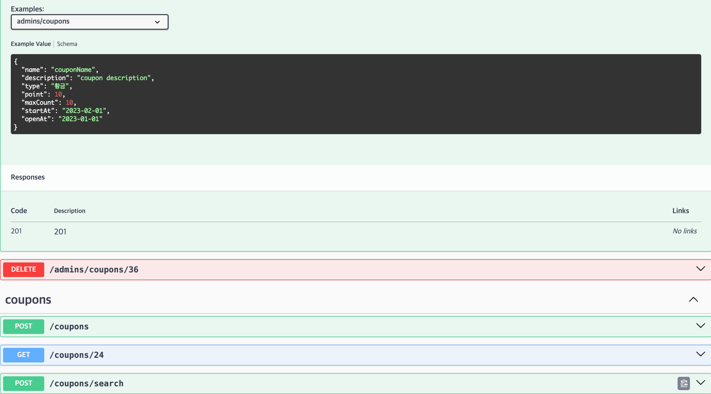
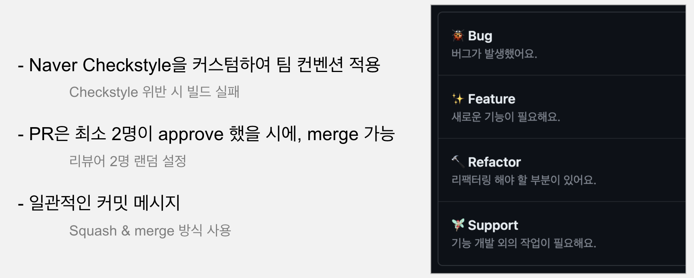
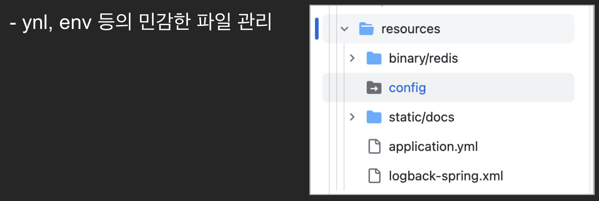
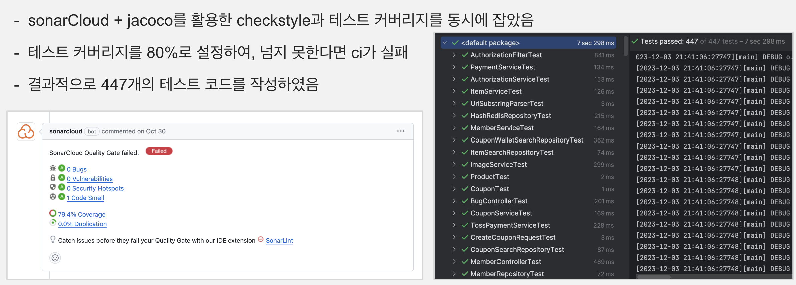

## 🐥 MOABAM 서비스

  

## 👨‍👨‍👧 Backend Team 소개

|                                      김영명                                       |                                    김희빈(PO)                                     |                                      박세연                                       |                                      신재윤                                       |                                    홍혁준(SM)                                     |
|:------------------------------------------------------------------------------:|:------------------------------------------------------------------------------:|:------------------------------------------------------------------------------:|:------------------------------------------------------------------------------:|:------------------------------------------------------------------------------:|
|                                   DEVELOPER                                    |                                   DEVELOPER                                    |                                   DEVELOPER                                    |                                   DEVELOPER                                    |                                   DEVELOPER                                    |
|  |  |  |  |  |
|                     [ymkim97](https://github.com/ymkim97)                      |                      [kmebin](https://github.com/kmebin)                       |                     [parksey](https://github.com/parksey)                      |                   [DevUni](https://github.com/Shin-Jae-Yoon)                   |                 [HongDosan](https://github.com/HyuckJuneHong)                  |
|                                방 도메인, 루틴 인증(메인)                                |                            상품 도메인, 결제, 에러 알림, BE 팀장                            |                               회원 도메인, 랭킹 어드민 페이지                               |                       방 도메인, 루틴 인증(서브), 인프라 (AWS, CI/CD)                       |                            쿠폰 도메인, 알림, 선착순 이벤트, 캐싱                             |

  

## 공통 협업 방식

## 서비스 아키텍처

## CI/CD 파이프라인

## 테이블 아키텍처

## API 명세

## 컨벤션

## Config 관리

## Test

## 협업

